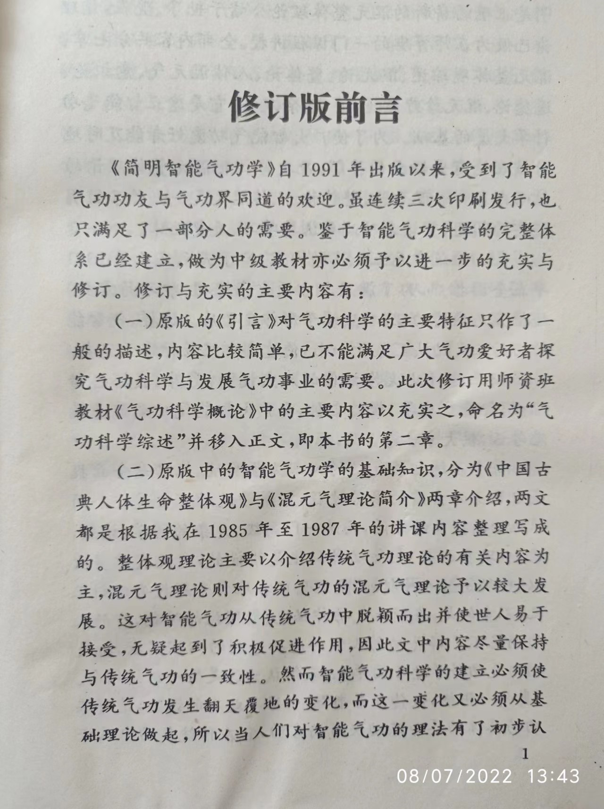
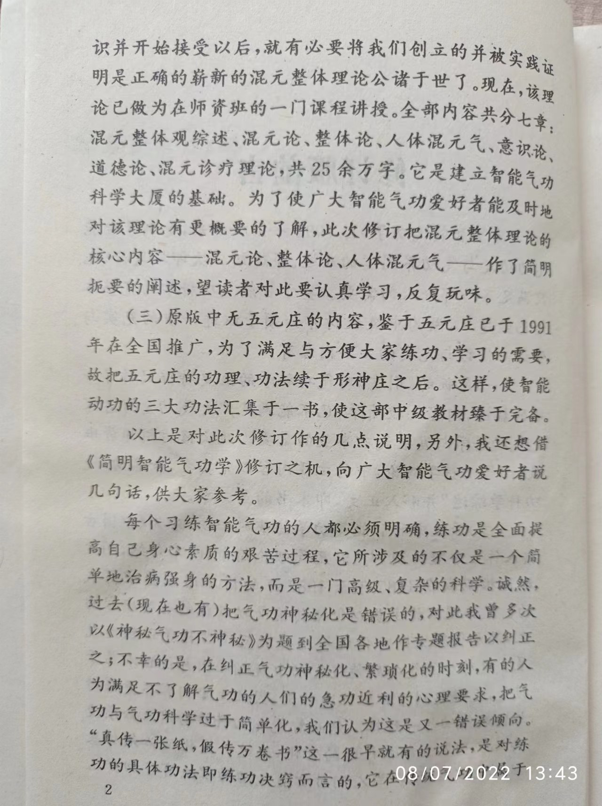
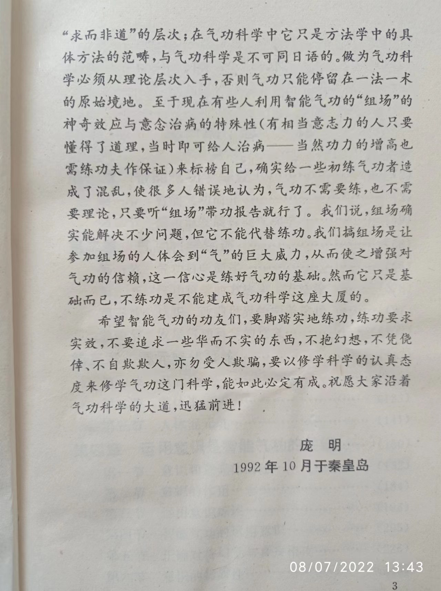

# 修订版前言

《简明智能气功学》自1991年出版以来,受到了智能气功功友与气功界同道的欢迎。虽连续三次印刷发行，也只满足了一部分人的需要。鉴于智能气功科学的完整体系已经建立，做为中级教材亦必须予以进一步的充实与修订。修订与充实的主要内容有:

(一)原版的《引言》对气功科学的主要特征只作了一般的描述，内容比较简单，已不能满足广大气功爱好者探究气功科学与发展气功事业的需要。此次修订用师资班教材《气功科学概论》中的主要内容以充实之，命名为“气功科学综述”并移入正文,即本书的第二章。

(二)原版中的智能气功学的基础知识,分为《中国古典人体生命整体观》与《混元气理论简介》两章介绍，两文都是根据我在1985 年至1987 年的讲课内容整理写成的。整体观理论主要以介绍传统气功理论的有关内容为主,混元气理论则对传统气功的混元气理论予以较大发展。这对智能气功从传统气功中脱颖而出并使世人易于接受，无疑起到了积极促进作用,因此文中内容尽量保持与传统气功的一致性。然而智能气功科学的建立必须使传统气功发生翻天覆地的变化,而这一变化又必须从基础理论做起，所以当人们对智能气功的理法有了初步认识并开始接受以后,就有必要将我们创立的并被实践证明是正确的崭新的混元整体理论公诸于世了。现在，该理论已做为在师资班的一门课程讲授。全部内容共分七章，混元整体观综述、混元论、整体论、人体混元气、意识论、道德论、混元诊疗理论，共25余万字。它是建立智能气功科学大厦的基础。为了使广大智能气功爱好者能及时地对该理论有更概要的了解，此次修订把混元整体理论的核心内容--混元论、整体论、人体混元气--作了简明扼要的阐述，望读者对此要认真学习,反复玩味。

(三)原版中无五元庄的内容，鉴于五元庄已于1991年在全国推广,为了满足与方便大家练功、学习的需要，故把五元庄的功理、功法续于形神庄之后。这样，使智能动功的三大功法汇集于一书，使这部中级教材臻于完备。

以上是对此次修订作的几点说明，另外，我还想借《简明智能气功学》修订之机，向广大智能气功爱好者说几句话,供大家参考。

每个习练智能气功的人都必须明确,练功是全面提高自己身心素质的艰苦过程，它所涉及的不仅是一个简单地治病强身的方法，而是一门高级、复杂的科学。诚然，过去(现在也有)把气功神秘化是错误的，对此我曾多次以《神秘气功不神秘》为题到全国各地作专题报告以纠正之;不幸的是,在纠正气功神秘化、繁琐化的时刻，有的人为满足不了解气功的人们的急功近利的心理要求，把气功与气功科学过于简单化,我们认为这是又一错误倾向。“真传一张纸,假传万卷书”这一很早就有的说法，是对练功的具体功法即练功决窍而言的，它在传统气功中属于“求而非道”的层次;在气功科学中它只是方法学中的具体方法的范畴,与气功科学是不可同日语的。做为气功科学必须从理论层次入手,否则气功只能停留在一法一术的原始境地。至于现在有些人利用智能气功的“组场”的神奇效应与意念治病的特殊性(有相当意志力的人只要懂得了道理,当时即可给人治病--当然功力的增高也需练功夫作保证)来标榜自己,确实给一些初练气功者造成了混乱,使很多人错误地认为,气功不需要练,也不需要理论，只要听“组场”带功报告就行了。我们说，组场确实能解决不少问题，但它不能代替练功。我们搞组场是让参加组场的人体会到“气”的巨大威力,从而使之增强对气功的信赖，这一信心是练好气功的基础。然而它只是基础而已,不练功是不能建成气功科学这座大厦的。
希望智能气功的功友们,要脚踏实地练功,练功要求实效,不要追求一些华而不实的东西,不抱幻想,不凭侥倖、不自欺欺人,亦勿受人欺骗,要以修学科学的认真态度来修学气功这门科学,能如此必定有成。祝愿大家沿着气功科学的大道,迅猛前进!

庞明

1992年10月于秦皇岛

